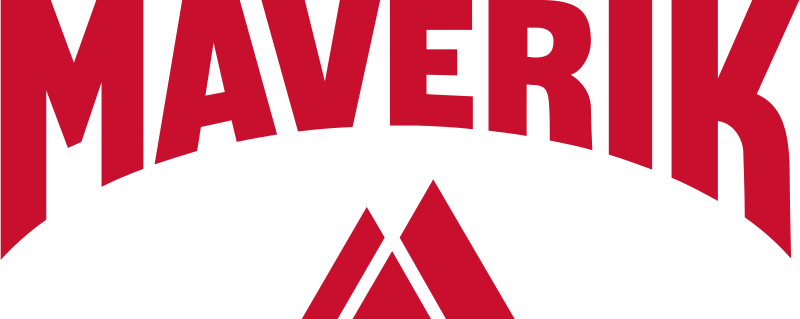

# Maverik Time Series Forecasting

## Business Problem and Objective
Maverik has emerged as a formidable force in the dynamic realm of retail convenience, boasting a vast network of over 400 locations spanning the western United States. A recent strategic acquisition of the gas station company "Kum & Go" has propelled Maverik's growth, effectively doubling its store count and positioning it for sustained expansion. With plans to construct around 30 new stores each year, Maverik's trajectory signals a commitment to innovation and market leadership.

Against this backdrop, the imperative to accurately forecast the first-year sales of these new establishments takes center stage. The following initiative aims to develop a comprehensive sales forecast model grounded in historical data analysis to respond to this strategic need. This model seeks to empower strategic and well-informed financial decision-making processes and foster a data-driven approach that optimizes resource allocation and operational planning. The refined sales forecast, a product of this endeavor, will be pivotal in creating precise and reliable Return on Investment (ROI) documents. This, in turn, enhances the overall accuracy and credibility of financial projections, serving as a valuable tool for stakeholders and investors navigating the burgeoning landscape of Maverik's dynamic enterprise.

## Group Solution
Our team meticulously developed several advanced forecasting models, including SARIMA, ARIMA, Linear Regression, Prophet, and XGBoost, tailored to address the company's specific requirements. Our initial data exploration highlighted the imperative nature of data cleaning to ensure the accuracy and reliability of our models. In addressing this, we implemented effective strategies for handling missing values and navigating the intricacies of time series forecasting.

Our primary objective was to identify the most robust forecasting model that aligns with Maverik's predefined benchmarks for key target variables: Inside Sales, Food Sales, Unleaded, and Diesel. Rigorous testing and evaluation were conducted to ensure that the selected model not only met but exceeded the performance expectations set by Maverik.

Following identifying the optimal forecasting model, our focus shifted toward selecting the most suitable stores for modeling our recommendations. The features of these chosen model stores were meticulously presented to Maverik, aiming to provide valuable insights that could be seamlessly incorporated into their strategic planning, particularly in the establishment of new stores. Our commitment to delivering actionable, data-driven recommendations underscores our dedication to supporting Maverik's long-term success and growth objectives.

## Personal Contribution
As a team member, I played an active role in constructing and developing the optimal forecasting model presented to Maverik. Throughout the exploratory phase, I contributed to the comprehensive examination of datasets, ensuring meticulous handling of missing values to fortify the integrity of our analyses. My responsibilities extended to amalgamating datasets, particularly in scrutinizing and addressing missing values associated with specific store IDs.

Beyond data exploration, I made significant contributions by formulating forecasting models, including VAR, SARIMA, and ARIMA. Although I submitted my SARIMA model for consideration, regrettably, it did not outperform the XGBoost model, which the team ultimately presented to Maverik. Despite the outcome, this experience underscored the value of rigorous evaluation and the importance of selecting the most robust model to align with Maverik's strategic objectives.

In addition to my substantive role in the model development process, I took an active and integral part in enhancing the overall quality of our team's presentation to Maverik. My commitment extended to regular attendance at team meetings, where I consistently offered valuable insights and constructive suggestions to refine and optimize our presentation. Moreover, I assumed a leadership role in spearheading the creation of our presentation slides, ensuring that they effectively communicated the depth of our analyses and the merits of the chosen forecasting model. This collaborative effort reflects my dedication to elevating the professionalism and impact of our team's deliverables, ultimately contributing to the comprehensive success of the project and meeting the expectations of our esteemed client, Maverik.

## Business Value of the Solution
Our team's concerted efforts are poised to significantly enhance the company's Return on Investment (ROI) by providing strategic recommendations that can be seamlessly integrated whenever the organization deems it reasonable. Our team's rigorous analysis and development of forecasting models aim to furnish Maverik with actionable insights, empowering the company to make informed decisions that align with its overarching business objectives. This strategic collaboration positions Maverik to capitalize on our suggestions' full potential, optimizing ROI and fostering sustained growth.

In addition to offering immediate value, our forward-thinking approach extends to calculating forecasted revenue for newly established stores, ensuring that Maverik possesses a comprehensive reference for future planning. By providing a robust foundation for predicting revenue streams, our team's endeavors support Maverik's pursuit of sustained success and informed decision-making, further solidifying our commitment to delivering impactful and enduring solutions.

## Challenges Encountered
The demanding schedules of our team members posed a notable challenge in establishing specific meeting times. Compounding this, our collective need for more familiarity with time series forecasting, owing to limited educational and practical backgrounds, initially presented hurdles. Undeterred by these obstacles, we persevered, dedicating ourselves to independent learning endeavors to acquire a solid grasp of the concepts.

Despite the constraints posed by our busy schedules and initial unfamiliarity with the subject matter, our team's proactive approach to self-directed learning has allowed us to enhance our expertise in time series forecasting steadily. Through collaborative efforts and a commitment to overcoming challenges, we have successfully navigated these initial obstacles, positioning ourselves to effectively contribute to accomplishing the project's goals.

## Key Learnings from the Project
Throughout this project, I acquired valuable skills in crafting time series forecasting models, gaining a nuanced understanding of handling time-constrained data to predict revenue accurately. Beyond the technical facets of the project, I cultivated essential teamwork skills, learning to harmoniously contribute to our collective effort to ensure the project's success and align with the expectations set by Maverik. This experience has expanded my technical proficiency and refined my collaborative and strategic capabilities, positioning me for continued professional growth.

